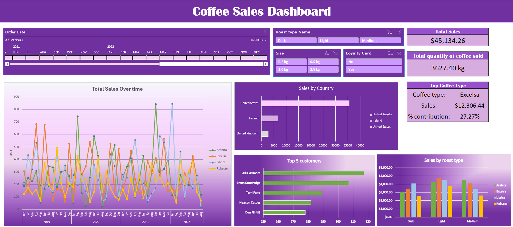

## Coffee Sales Dashboard (Excel Project)

📌 Project Overview
This project showcases an interactive Excel dashboard built to analyze coffee sales data.
It provides key insights into sales performance, product contribution, customer trends, and regional distribution.

The dashboard is fully interactive, with slicers and filters for time period, roast type, coffee size, and loyalty card usage.

🎯 Objectives
Track total sales and coffee quantity sold over time.

Identify top-performing coffee type and its % contribution.

Analyze sales by country and sales by roast type.

Highlight top 5 customers driving revenue.

Enable interactivity for month/year/product filters.

🖼️ Dashboard Preview

📊 Key Features

✔️ Dynamic KPIs: Total Sales, Quantity Sold, Top Coffee Type & % Contribution
✔️ Trend Analysis: Line chart showing sales performance over time
✔️ Geographical Insights: Sales by country (United States, Ireland, UK)
✔️ Customer Insights: Top 5 customers by revenue
✔️ Category Analysis: Sales breakdown by roast type (Dark, Light, Medium)
✔️ Interactive Filters: Slicers for Date, Roast Type, Coffee Size, Loyalty Card

🛠️ Tools Used:
* Microsoft Excel
* Pivot Tables
* Pivot Charts
* Slicers & Timelines

📂 Repository Structure
📦 Coffee-Sales-Dashboard
 ┣ 📜 README.md              # Project documentation
 ┣ 📊 Coffee_Sales_Dataset.xlsx   # Raw dataset (anonymized)
 ┣ 📊 Coffee_Sales_Dashboard.xlsx # Final dashboard file
 ┗ 🖼️ Coffee_Dashboard.png    # Dashboard screenshot

🚀 How to Use:
Download the Excel dashboard file from this repo.

Open in Microsoft Excel (2016 or later recommended).

Use the filters to explore sales insights dynamically.

📈 Business Impact

This dashboard demonstrates how Excel can be leveraged for business reporting and analytics.
Similar dashboards can be adapted for FMCG, retail, and e-commerce companies to:

Track performance against KPIs

Identify growth opportunities

Support data-driven decision-making

👤 Author

Subhayan Basu

💼 Aspiring Data Analyst | Finance & Analytics Enthusiast

📍 Kolkata, India
🔗 LinkedIn Profile
   linkedin.com/in/subhayanbasu

✨ If you like this project, don’t forget to ⭐ star the repo!
